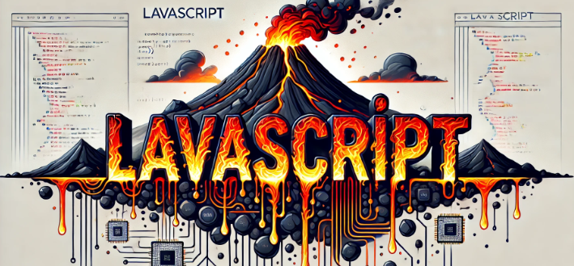

<p align="center">

</p>


# LavaScript

Welcome to LavaScript, the programming language you didn't know you needed! Are you tired of those boring error messages in JavaScript? Do you feel like your mistakes should have more... consequences? Well, look no further! LavaScript is here to bring the heat.

## What is LavaScript?

LavaScript is just like JavaScript, but with a twist. If you write bad code, your JS app will melt into itself. It's the ultimate punishment for those pesky bugs and errors. Think of it as a way to teach yourself better coding practices through sheer, molten intimidation.

## Why LavaScript?

Because why not? Here are some compelling reasons to switch to LavaScript today:

- **Extreme Debugging**: Every error will literally make your machine cry. Feel the burn!
- **Unique Learning Experience**: You'll quickly learn to avoid mistakes when your js application turns into a frying pan.
- **Bragging Rights**: Tell your friends you code in a language that punishes errors with heat. They'll be impressed, or at least concerned.

## How to Use LavaScript

1. **Compile**:
    ```bash
    git clone git@github.com:0xbigshaq/LavaScript.git
    cd LavaScript
    ./configure
    make
    ```

2. **Running Your First LavaScript Program**:
    ```bash
    node lavascript.js
    ```

3. **Write Some Code**:
```javascript
function lol() {
  try {
    console.NonExist();
  } catch(e) {
    console.log(e);
  }
}

lol();              // Will not crash because it's wrapped with try/catch. Error is printed and the script continues.
console.NonExist(); // Should crash because you don't know how to write code that handle errors.
```

Output:
```
$ lavascript ./lava.js
TypeError: (intermediate value)["NonExist"] is not a function
    at lol (test/lava.js:3)
    at main (test/lava.js:9)

[!] Bad programmer
Segmentation fault
```

## FAQ

### Is LavaScript real?

No, this is a fork of [njs](https://github.com/nginx/njs) with an [intentional segfault](https://github.com/0xbigshaq/LavaScript/commit/ce82de8f7684cad9a3d509e908b5d9f0c6500770#diff-3446f78186ad7c745d1a4ef73b1ff7b4fc4cd9ae3412fc17a4ec604560b85a10) when your JS script have a runtime error.

### How can I contribute?

Feel free to submit pull requests with more ridiculous features! The more outlandish, the better.

## Disclaimer

LavaScript is a parody and should not be used in production environments. The creators are not responsible for any actual overheating that may occur if you take this project too seriously.

